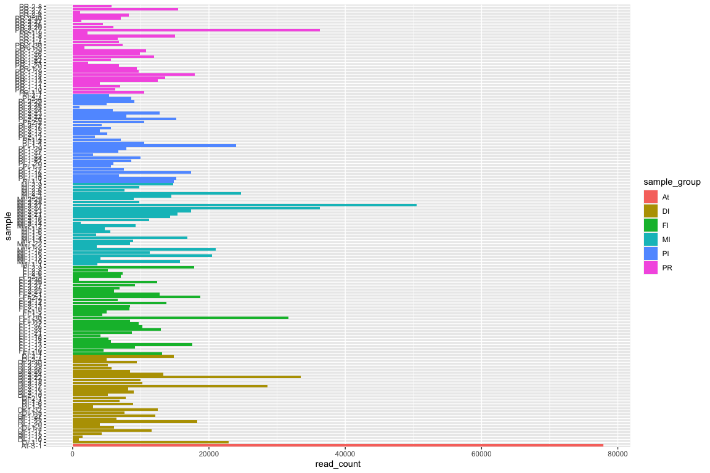

Check Raw Data
================

For example we might have a DNA sequencing project. One thing we could
do is check for contamination with organisms other than our target
organism. To do this we could use the software, kraken which we would
run on the HPC. The outputs of that will be in
`hpc/kraken/kraken-report.mpa`

One thing we might be concerned with is bacterial contamination, which
often happens at the sequencing centre. We can plot the number of
bacterial classified reads per/sample to see if there are any with
especially high levels.

<!-- -->
