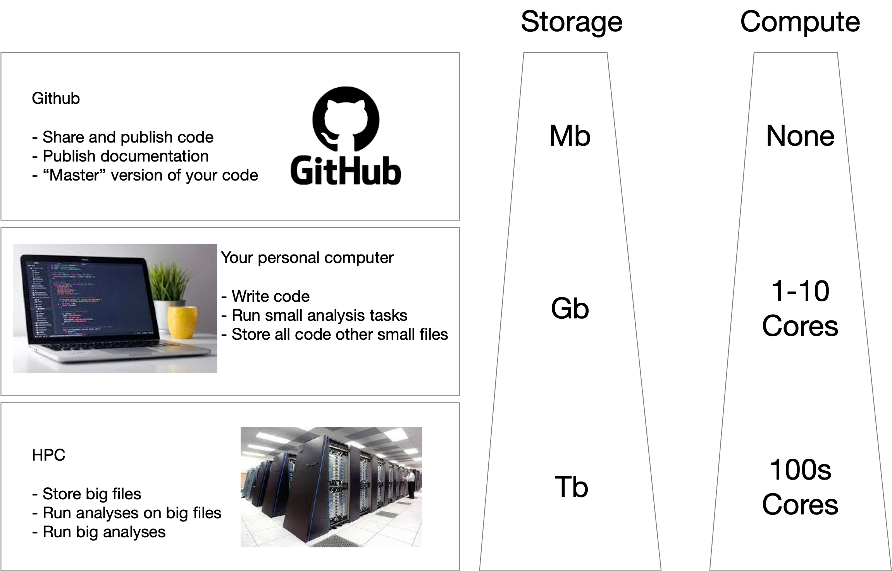

# Project Template

## Motivation

One of the most important things in bioinformatics is staying organised.  This can be daunting because it involves managing code and data in a way that lets you get your day to day work done, while also ensuring that your project is reproducible and sharable with colleagues. 

To make matters worse your project often needs to live in multiple places.  The diagram below shows a typical setup. Some parts of your project will be things you want to share publicly, or at least with your collaborators.  This is best kept in a github repository.  Your day to day work is done on a personal computer of some kind and you will often need to run larger analyses (or store larger files) on a high performance computing system. 



The aim of this project template is to provide a framework for a workflow involving these three components. 

#### Adapt this template to your own project

- Replace "project-template" with the name of your own project
- Replace cloudstor URL with a download link to your own data
- Divide your project into numbered RMarkdown files (eg `01.check_raw_data.Rmd`, `02.firstresult.Rmd`)
- Place large data files and outputs from compute intensive processes in the `hpc` folder
- Add paths to data files that will be read by RMarkdown scripts in `data.list`

#### When you are ready to publish your project

- Clean up this file `README.md`. Remove generic instructions like this one. Flesh out your project outline and instructions to users
- Make sure your latest code is committed and pushed to github
- Run `build_data_package.sh`
- Upload the resulting `data.tgz` file to a repository that will hold large data
- Replace the download URL in the instructions below with an appropriate URL to access your data

## Providing larger files via cloudstor

This repository contains RMarkdown files and R code but does not contain raw data.  To obtain the data required to run these scripts you should do the following;

1. Checkout this repository 
```bash
git clone https://github.com/marine-omics/project-template.git
```
2. Download the raw data and unpack it from within the project repository.
```bash
cd project-template
wget 'http://data.qld.edu.au/public/Q5999/marine-omics/project-template/data.tgz' -O data.tgz
tar -zxvf data.tgz
```


### Project Outline

- [Initial Data Quality Check](01.check_raw_data.Rmd)

